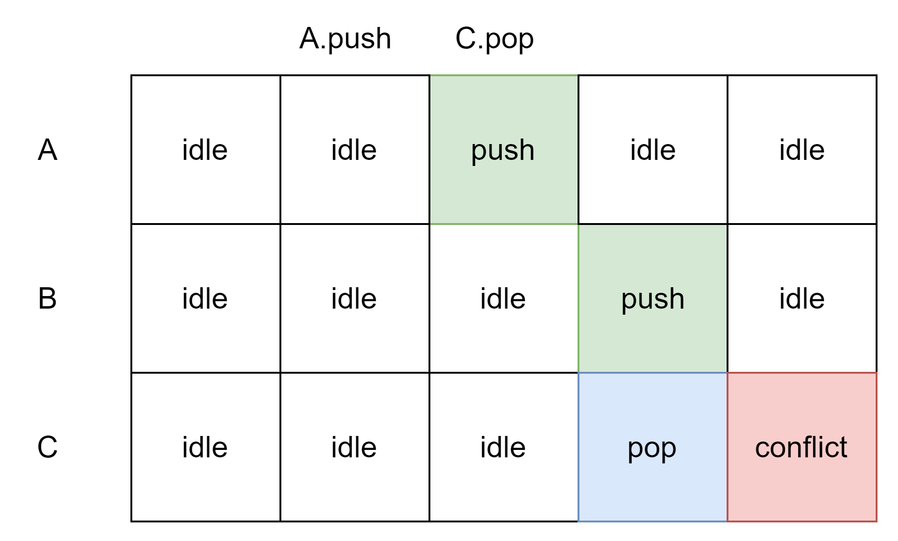

# Virtualization

## Test Case

- TC_SRAM_NEW
简单功能测试

- TC_SRAM_NEW2
测试一种冲突的情况：

测试中先将 Tree A 前两层 push 满，使得后续 push 需要到第三层，然后发出 A.push 并在下一周期发出 C.push ，以此检测冲突是否正确处理（主要检测状态机是否发生滞后）。

- TC_SRAM_NEW3&4&5
测试 SRAM 的容量：将所有的树全部 push 满，然后再 pop 空。
说明：3 中有 8 棵树，8 个 SRAM；4 中有 4 棵树，4 个 SRAM；5 中有 2 棵树，2 个 SRAM。